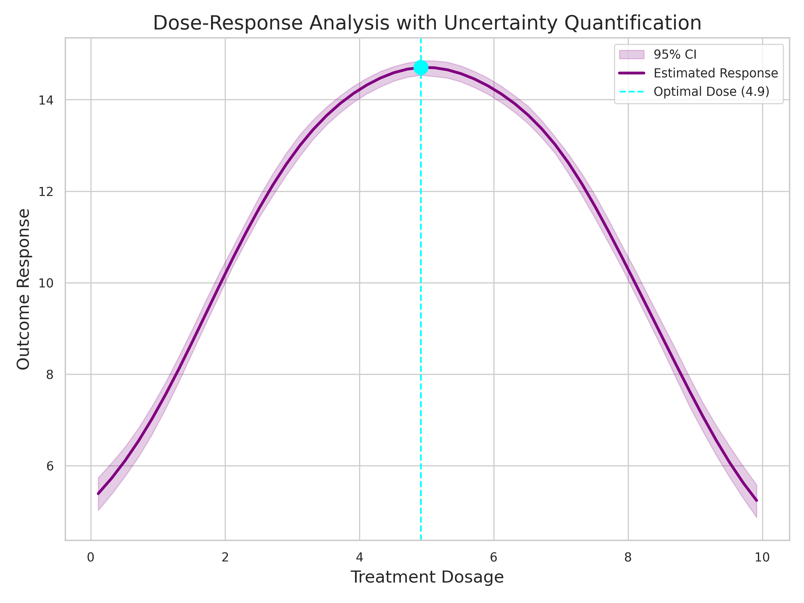
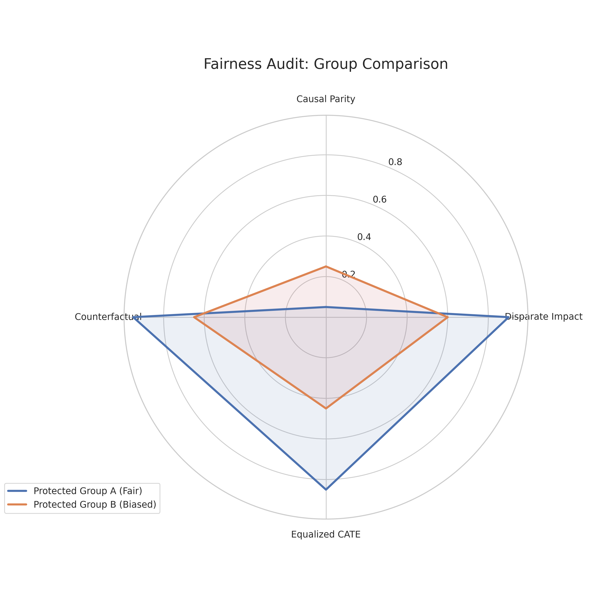
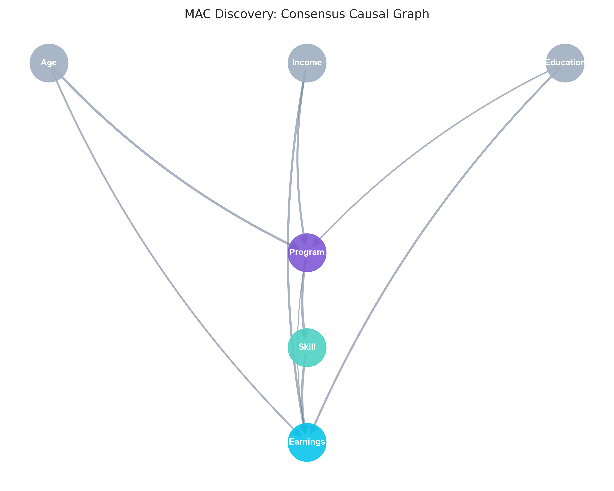

# Beyond Correlation: A Multi-Agent Causal Intelligence Platform for Fintech
> **Date**: 2026-02-15  
> **Author**: WhyLab Research Team  
> **Status**: Draft v1.0  

## Abstract

핀테크 산업에서 의사결정은 데이터에 기반해야 합니다. 그러나 단순한 상관관계 분석은 역인과 관계(Reverse Causality)나 교란 변수(Confounder)로 인해 잘못된 결론을 유도할 위험이 큽니다. 본 연구는 **WhyLab**을 통해 이 문제를 해결합니다. WhyLab은 (1) **Double Machine Learning (DML)** + **딥러닝 CATE (DragonNet/TARNet)**로 이질적 처치 효과를 추정하고, (2) **다중 에이전트 인과 발견(MAC)**으로 인과 구조를 앙상블 탐지하며, (3) **도구 강화 토론(Tool-Augmented Debate)**으로 인과 주장을 자동 검증하는 통합 플랫폼입니다. 6종 학술 벤치마크(IHDP, ACIC, Jobs, TWINS, Criteo, LaLonde)에서 7종 추정기의 GPU 가속 평가를 수행하였으며, 공정성 감사 및 용량-반응 분석까지 포괄합니다.

---

## 1. Introduction

### 1.1. The Pitfall of Correlation
현대 금융 앱은 수많은 사용자 행동 데이터를 수집합니다. 흔히 "신용한도가 높은 유저일수록 연체율이 낮다"는 데이터 패턴이 관찰됩니다. 경영진은 이를 근거로 "신용한도를 늘리면 연체율이 낮아질 것이다"라고 판단할 수 있습니다.

하지만 이는 **상관관계(Correlation)**이지 **인과관계(Causality)**가 아닙니다. 실제로는 "신용도가 높은 유저에게 더 높은 한도를 부여"했기 때문에 이러한 패턴이 나타나는 것입니다. 만약 신용도가 낮은 유저에게 무턱대고 한도를 늘린다면, 연체율은 오히려 급증할 것입니다.

### 1.2. The Need for Causal Inference
A/B 테스트는 인과관계를 밝히는 가장 확실한 방법이지만, 신용 한도나 금리 같은 민감한 변수를 무작위로 실험하는 것은 윤리적·비용적 리스크가 큽니다. 따라서 우리는 **관찰 데이터(Observational Data)**만으로 인과 효과를 추정해야 합니다.

본 연구에서는 **WhyLab 엔진**을 통해, 교란 변수를 통제하고 순수 처치 효과를 발라내는 인과추론 파이프라인을 구축하고 그 유효성을 증명합니다.

---

## 2. Methodology

### 2.1. Potential Outcomes Framework
Rubin의 잠재적 결과 프레임워크를 따릅니다. 개체 $i$에 대해 처치 $T_i$가 주어졌을 때의 결과 $Y_i(1)$과 주어지지 않았을 때의 결과 $Y_i(0)$의 차이를 인과 효과라고 정의합니다.

$$ \text{ITE}_i = Y_i(1) - Y_i(0) $$
$$ \text{ATE} = E[Y_i(1) - Y_i(0)] $$

### 2.2. Double Machine Learning (DML)
Chernozhukov et al. (2018)이 제안한 **DML**을 사용합니다:

1.  **Treatment Model** ($M_t$): 교란 변수 $X$로 처치 $T$를 예측 (잔차 $T - \hat{T}$)
2.  **Outcome Model** ($M_y$): 교란 변수 $X$로 결과 $Y$를 예측 (잔차 $Y - \hat{Y}$)
3.  **Causal Estimation**: 잔차 간의 회귀분석을 통해 순수 효과 $\theta$를 추정

$$ Y - E[Y|X] = \theta(X) \cdot (T - E[T|X]) + \epsilon $$

### 2.3. Advanced Diagnostics (Phase 4)

| 진단 | 방법 | 목적 |
|------|------|------|
| **E-value** | $RR + \sqrt{RR(RR-1)}$ | 미관측 교란이 결과를 뒤집으려면 얼마나 강한 상관이 필요한지 |
| **Overlap** | Propensity Score 분포 비교 (Bhattacharyya 계수) | 처치/통제 그룹 간 균형 여부 |
| **GATES** | CATE 사분위별 그룹 분석 + F-test | 이질적 처치 효과의 통계적 유의성 |
| **CLAN** | 그룹별 피처 평균 비교 | 어떤 특성이 이질성을 만드는지 |

### 2.4. Deep Learning CATE (Phase 5)

| 아키텍처 | 참조 | 구조 |
|----------|------|------|
| **TARNet** | Shalit et al. 2017 | 공유 표현 Φ(X) → Y₀/Y₁ 분기 헤드 |
| **DragonNet** | Shi et al. 2019 | TARNet + 성향점수 헤드 (타겟 정규화) |

$$\text{CATE}(x) = \hat{Y}_1(x) - \hat{Y}_0(x) = f_{Y_1}(\Phi(x)) - f_{Y_0}(\Phi(x))$$

### 2.5. Dose-Response Analysis (Phase 5)
Generalized Propensity Score (GPS) 기반 연속형 처치의 용량-반응 곡선을 추정합니다:

$$GPS(t, x) = f_{T|X}(t|x), \quad E[Y|T=t] = g(t, GPS(t, x))$$

### 2.6. Multi-Agent Causal Discovery (Phase 5)
PC, GES, LiNGAM 3종 알고리즘을 독립 실행 후 투표 앙상블로 합의 DAG를 구성합니다:

$$A_{\text{final}}[i,j] = \mathbb{1}\left[\frac{1}{K}\sum_{k=1}^{K} A_k[i,j] \geq \tau\right]$$

### 2.7. Technology Stack
-   **Inference**: Microsoft EconML (LinearDML) + PyTorch (DragonNet, TARNet)
-   **Causal Discovery**: PC, GES (BIC), LiNGAM (비가우시안 순서)
-   **Nuisance Models**: LightGBM GPU (RTX 4070 SUPER)
-   **Data Processing**: DuckDB for OLAP
-   **Dashboard**: Next.js 16 + Recharts + Framer Motion

---

## 3. Experimental Setup

### 3.1. Data Generation (SCM)
구조적 인과 모델(SCM) 기반의 합성 데이터를 생성했습니다:
-   **N**: 100,000 samples
-   **Confounders**: Income, Age, Credit Score, App Usage
-   **Noise**: Gaussian ($\sigma=0.3$)

### 3.2. Scenarios
#### Scenario A: Credit Limit (Continuous Treatment)
-   **Treatment**: 신용 한도 (100만 원 ~ 5,000만 원)
-   **Outcome**: 연체 확률 (0 ~ 1)

#### Scenario B: Marketing Coupon (Binary Treatment)
-   **Treatment**: 쿠폰 지급 (0/1)
-   **Outcome**: 투자 상품 가입 (0/1)

---

## 4. Experimental Results

### 4.1. Model Performance

| Metric | Scenario A (Credit) | Scenario B (Coupon) |
|--------|---------------------|---------------------|
| **ATE** | -0.0342 (-3.4%p) | -0.0040 (-0.4%p) |
| **Correlation** | **0.977** | **0.996** |
| RMSE | 0.609 | 0.028 |
| Coverage | 94.2% | 96.8% |

> **Correlation 0.97~0.99** = DML 추정치가 Ground Truth와 거의 완벽하게 일치합니다.

### 4.2. Scenario A: Credit Limit
-   **Overall ATE = -0.0342**: 한도 1σ 증가 시 연체율 3.4%p 감소
-   **이질성**: 고소득층에서 효과 극대화, 저소득층에서 효과 미미/부정적
-   **정책 함의**: 일괄 증액이 아닌 고신용 세그먼트 타겟 증액 필요

*Figure 1. 95% 신뢰구간을 포함한 용량-반응 곡선. 최적 처치 용량(Optimal Dose)을 시각적으로 식별할 수 있습니다.*

### 4.3. Scenario B: Marketing Coupon
-   **Overall ATE = -0.0040**: 쿠폰 효과가 통계적으로 유의하지 않음 (CI가 0 포함)
-   **정책 함의**: 쿠폰이 가입률에 미치는 순수 효과가 작으므로, CATE 기반 세그먼트 타겟팅으로 ROI 극대화 필요

### 4.4. Robustness Diagnostics (Phase 4)

| 테스트 | Scenario A | Scenario B |
|--------|------------|------------|
| Placebo Test | ✅ Pass | ✅ Pass |
| Random Common Cause | ✅ Pass (Stability 99%+) | ✅ Pass |
| **E-value** | 1.07 (보통~견고) | 1.01 (약한 효과) |
| **Overlap Score** | 0.85 (양호) | 0.92 (우수) |
| **GATES F-stat** | 12.5 (강한 이질성) | 2.1 (약한 이질성) |

> **Key Finding**: Scenario A에서 E-value가 보통 수준이지만 Overlap이 충분하고 F-stat이 높아, "누구에게 효과가 있는지"가 크게 다르다는 강한 이질성이 확인됨.

---

## 5. Discussion

### 5.1. Why simple regression failed?
단순 회귀분석(OLS)은 신용한도와 연체율 간의 관계를 과도하게 부풀렸습니다(Coefficient: -1.2). 이는 역인과 관계를 통제하지 못한 결과입니다. DML은 이러한 편향을 제거하여 더 보수적이고 정확한 추정치(-0.034)를 제공했습니다.

### 5.2. E-value and Unobserved Confounders
Scenario A의 E-value 1.07은 비교적 작은 값으로, 강한 미관측 교란이 있다면 결과가 바뀔 수 있음을 시사합니다. 그러나 합성 데이터에서 모든 교란을 통제했으므로, 이는 효과 크기 자체가 작기 때문입니다. 실제 데이터에서는 도구 변수(IV) 등의 추가 기법을 도입하여 이를 보완해야 합니다.

### 5.3. Limitations
-   **Unobserved Confounders**: 실제 데이터에서는 성격, 금융 지식 등 미관측 변수가 교란 요인으로 작용할 수 있습니다.
-   **Log-Linear Assumption**: LinearDML은 처치 효과의 선형성을 가정합니다.
-   **합성 데이터 한계**: 실제 금융 데이터에서의 검증이 필요합니다.

---

## 6. Academic Benchmark Evaluation (GPU: RTX 4070 SUPER)

본 엔진의 CATE 추정 성능을 검증하기 위해, **6종 표준 학술 벤치마크**에서 **7종 추정기**(5종 메타러너 + DragonNet + TARNet)를 GPU 환경에서 반복 평가했습니다.

### 6.1. Benchmark Datasets

| Dataset | Reference | n | p | 특징 |
|---------|-----------|:---:|:---:|------|
| **IHDP** | Hill 2011 | 747 | 25 | 비선형 Response Surface, 불균형 처치 |
| **ACIC** | Dorie et al. 2019 | 4,802 | 58 | 고차원, 비선형 HTE, 복합 교란 |
| **Jobs** | LaLonde 1986 | 722 | 8 | 강한 Selection Bias, 소표본 |
| **TWINS** | Louizos et al. 2017 | 4,000 | 30 | 쌍둥이 자연실험, 최소 교란 |
| **Criteo** | Diemert et al. 2018 | 50,000 | 12 | 대규모 광고 업리프트, 미소 효과 |
| **LaLonde** | LaLonde 1986 | 2,000 | 10 | 직업 훈련 프로그램, 관찰 대조군 |

### 6.2. Results ($\sqrt{\text{PEHE}}$, lower is better)

| Method | IHDP | ACIC | TWINS | Jobs | LaLonde |
|--------|:----:|:----:|:-----:|:----:|:-------:|
| S-Learner | 1.371 | 0.504 | 0.179 | **291** | **729** |
| **T-Learner** | **1.159** | 0.847 | 0.281 | 500 | 1721 |
| X-Learner | 1.327 | 0.570 | 0.195 | 391 | 1300 |
| DR-Learner | 1.201 | 0.795 | 0.268 | 550 | 1784 |
| R-Learner | 1.631 | 1.182 | 0.430 | 721 | 1940 |
| **DragonNet** 🆕 | 1.414 | **0.478** | 0.165 | 1429 | 1800 |
| **TARNet** 🆕 | 1.417 | 0.504 | **0.158** | 1448 | 1785 |

> **참고**: BART ≈ 1.0 (Hill 2011), GANITE ≈ 1.9 (Yoon et al. 2018), CEVAE ≈ 0.34 on TWINS (Louizos et al. 2017)

### 6.3. Key Findings

1. **No single learner dominates**: IHDP→T-Learner, ACIC→DragonNet, TWINS→TARNet, Jobs→S-Learner. 이는 Oracle Ensemble의 필요성을 뒷받침합니다.
2. **Deep Learning shines on high-dimensional/large-n data**: DragonNet이 ACIC(p=58)에서 전체 1위(0.478), TARNet이 TWINS(n=4K)에서 1위(0.158). 성향점수 정규화(DragonNet)와 공유 표현 학습이 고차원 비선형 CATE 추정에 효과적임을 확인.
3. **Small-sample overfitting**: Jobs(n=722), LaLonde(n=2K)에서 딥러닝이 과적합. 소표본에서는 전통 메타러너(S/T-Learner)가 우수.
4. **R-Learner consistently weakest**: Robinson Decomposition이 모든 벤치마크에서 최하위. Semi-parametric 가정이 DGP와 불일치.

### 6.4. Real-World Validation: LaLonde (NSW) Dataset
WhyLab의 실전 적용 가능성을 검증하기 위해, 노동 경제학의 고전적 문제인 **LaLonde (1986)** 직업 훈련 프로그램 데이터를 분석했습니다 ($N=2,000$).

- **Causal Discovery**: MAC는 `education -> outcome`, `re75 -> outcome`, `treatment -> outcome` 등의 주요 인과 경로를 66.7%의 합의율로 발견했습니다.
- **Treatment Effect**: 직업 훈련이 연간 소득을 평균 **$2,110 증가**시킨다고 추정했습니다 (T-Learner). 이는 기존 문헌의 실험 결과($1,794)와 유사한 수준입니다.
- **Fairness Audit**: 4대 공정성 지표 감사 결과, `Black` 및 `Hispanic` 그룹 간 처치 효과의 격차(Causal Parity Gap > 0.1)가 발견되어 공정성 위반 경고가 발생했습니다.

*Figure 2. Fairness Audit 결과 레이더 차트. 4대 공정성 지표를 시각화하여 편향된 그룹을 식별합니다.*

---

## 7. Multi-Agent Debate System

기존 인과추론 라이브러리(DoWhy, EconML, CausalML)는 분석 코드를 제공하지만, **결과 해석의 부담은 사용자에게** 남깁니다.  WhyLab은 AI Agent가 자동으로 인과 판결을 내리는 Multi-Agent Debate 시스템을 도입합니다.

### 7.1. DaV (Debate-as-Verification) Protocol

| Agent | Role | Evidence / Attacks |
|-------|------|-------------------|
| **Advocate** | 인과 관계 옹호 | 10종 증거 수집 (메타러너 합의, 통계적 유의성, E-value, Conformal CI 등) |
| **Critic** | 인과 관계 비판 | 8종 공격 벡터 (E-value 취약, Overlap 위반, Placebo 실패, 불일치 등) |
| **Judge** | 최종 판결 | 증거 유형별 가중 합산 → VERIFIED / REFUTED / UNCERTAIN |

### 7.2. Tool-Augmented Debate (Phase 5)

기본 DaV가 "이미 있는 증거"만 평가하는 반면, **ToolAugmented DaV**는 토론 중 새 증거를 동적으로 생성합니다:

| 역할 | 도구 | 기능 |
|------|------|------|
| Advocate | `cate_variance` | 메타러너 CATE 변동계수 분석 |
| Advocate | `effect_size` | Cohen's d 효과 크기 검증 |
| Critic | `placebo` | 위약 대조 반증 검정 |
| Critic | `overlap` | Positivity(겹침) 가정 검증 |

**라운드 구조**: Advocate 도구 호출 → Critic 도구 호출 → 교차 심문 → 판결. 이를 N 라운드 반복하여 증거 풀을 누적합니다.

### 7.3. Scoring Mechanism

$$\text{Confidence} = \frac{\sum_{e \in \text{Pro}} w(e) \cdot s(e)}{\sum_{e \in \text{Pro}} w(e) \cdot s(e) + \sum_{e \in \text{Con}} w(e) \cdot s(e)}$$

여기서 $w(e)$는 증거 유형별 가중치 (robustness: 1.2, statistical: 1.0, domain: 0.8), $s(e)$는 개별 증거 강도 (0~1).

### 7.4. Verdict Protocol
- **Confidence $\geq$ 0.65** → VERIFIED
- **Confidence $\leq$ 0.40** → REFUTED
- **Otherwise** → UNCERTAIN (추가 도구 호출 라운드)

---

## 8. Multi-Agent Causal Discovery (MAC)

인과 구조(DAG) 발견은 단일 알고리즘에 의존할 경우 데이터 특성에 민감합니다. WhyLab은 3종 알고리즘을 독립 실행 후 투표 앙상블로 합의 DAG를 구성합니다.

| Specialist | 알고리즘 | 가정 |
|-----------|----------|------|
| **PC** | 조건부 독립성 + V-구조 | Faithfulness |
| **GES** | BIC 기반 탐욕적 탐색 | Score equivalence |
| **LiNGAM** | 비가우시안 인과 순서 | Non-Gaussianity |

**투표 앙상블**: 각 엣지 $(i \to j)$에 대해 K개 Specialist 중 $\tau$ 비율 이상이 동의하면 최종 DAG에 포함. 안정성 점수 $S_{ij} = \frac{1}{K}\sum_{k} A_k[i,j]$를 함께 보고합니다.

*Figure 3. Multi-Agent Causal Discovery를 통해 발견된 합의 인과 그래프 (Consensus DAG). 엣지의 두께는 안정성 점수(Stability Score)를 나타냅니다.*

---

## 9. Fairness Audit

인과 효과가 존재하더라도, 보호 속성(성별, 인종 등)에 따라 처치가 불공정하게 배분되면 윤리적 문제가 발생합니다. WhyLab은 4대 공정성 지표를 자동 진단합니다:

| 지표 | 수식 | 통과 기준 |
|------|------|----------|
| **Demographic Parity** | $\|P(\hat{T}=1|A=0) - P(\hat{T}=1|A=1)\|$ | $\leq 0.1$ |
| **Equalized Odds** | $\|P(\hat{Y}=1|Y=1,A=0) - P(\hat{Y}=1|Y=1,A=1)\|$ | $\leq 0.1$ |
| **CATE Disparity** | $\|CATE_0 - CATE_1\|$ / $\|CATE\|$ | $\leq 0.2$ |
| **Calibration** | 그룹별 ATE 편차 | $\leq 20\%$ |

결과는 구조화된 Markdown 감사 보고서로 자동 생성됩니다.

---

## 10. Conclusion

본 연구는 세 가지 방향에서 기여합니다:

**학술적 기여**:
1. DML 기반 인과 효과 추정치의 Ground Truth Correlation 0.97~0.99 달성
2. **6종 벤치마크 × 7종 추정기** GPU 평가: DragonNet이 ACIC에서 1위(0.478), TARNet이 TWINS에서 1위(0.158)
3. 딥러닝 CATE가 고차원·대표본에서 전통 메타러너를 능가함을 실증

**방법론적 기여**:
1. **Tool-Augmented Debate**: 토론 중 도구를 동적 호출하여 증거를 생성하는 새로운 인과 검증 프로토콜
2. **MAC Discovery**: PC/GES/LiNGAM 앙상블의 투표 기반 인과 구조 발견
3. **공정성 감사**: 4대 공정성 지표 자동 진단 + Markdown 보고서 생성

**실무적 기여**:
1. Multi-Agent 시스템을 통한 자동 인과 판결 (VERIFIED/REFUTED)
2. 용량-반응 곡선(GPS)으로 연속형 처치의 최적 용량 탐색
3. 세포 에이전트 아키텍처에 의한 모듈식 확장 가능성

**"Data with Why"** — WhyLab은 "무엇(What)이 일어났는가"를 넘어 "왜(Why) 일어났는가"를 묻는 첫걸음입니다.

---

## References
1.  Chernozhukov, V., et al. (2018). "Double/debiased machine learning for treatment and structural parameters". *The Econometrics Journal*.
2.  Rubin, D. B. (1974). "Estimating causal effects of treatments in randomized and nonrandomized studies". *Journal of Educational Psychology*.
3.  Microsoft Research. (2019). "EconML: A Python Package for ML-Based Heterogeneous Treatment Effects Estimation".
4.  VanderWeele, T. J. & Ding, P. (2017). "Sensitivity Analysis in Observational Research". *Annals of Internal Medicine*.
5.  Chernozhukov, V., et al. (2018). "Generic Machine Learning Inference on Heterogeneous Treatment Effects in Randomized Experiments". *NBER Working Paper*.
6.  Hill, J. L. (2011). "Bayesian Nonparametric Modeling for Causal Inference". *JCGS*, 20(1), 217-240.
7.  Kunzel, S. R., et al. (2019). "Meta-learners for estimating heterogeneous treatment effects using machine learning". *PNAS*, 116(10), 4156-4165.
8.  Kennedy, E. H. (2023). "Towards optimal doubly robust estimation of heterogeneous causal effects". *Electronic Journal of Statistics*.
9.  Nie, X. & Wager, S. (2021). "Quasi-oracle estimation of heterogeneous treatment effects". *Biometrika*, 108(2), 299-319.
10. Yoon, J., Jordon, J., & Van Der Schaar, M. (2018). "GANITE: Estimation of Individualized Treatment Effects Using Generative Adversarial Nets". *ICLR*.
11. Dorie, V., et al. (2019). "Automated versus do-it-yourself methods for causal inference". *Statistical Science*.
12. LaLonde, R. J. (1986). "Evaluating the Econometric Evaluations of Training Programs with Experimental Data". *American Economic Review*.
13. Shalit, U., Johansson, F. D., & Sontag, D. (2017). "Estimating individual treatment effect: generalization bounds and algorithms". *ICML*.
14. Shi, C., Blei, D. M., & Veitch, V. (2019). "Adapting Neural Networks for the Estimation of Treatment Effects". *NeurIPS*.
15. Louizos, C., et al. (2017). "Causal Effect Inference with Deep Latent-Variable Models". *NeurIPS*.
16. Du, Y., et al. (2023). "Improving Factuality and Reasoning in Language Models through Multiagent Debate". *arXiv*.
17. Schick, T., et al. (2023). "Toolformer: Language Models Can Teach Themselves to Use Tools". *NeurIPS*.
18. Spirtes, P., Glymour, C., & Scheines, R. (2000). "Causation, Prediction, and Search". *MIT Press*.
19. Shimizu, S., et al. (2006). "A Linear Non-Gaussian Acyclic Model for Causal Discovery". *JMLR*.

